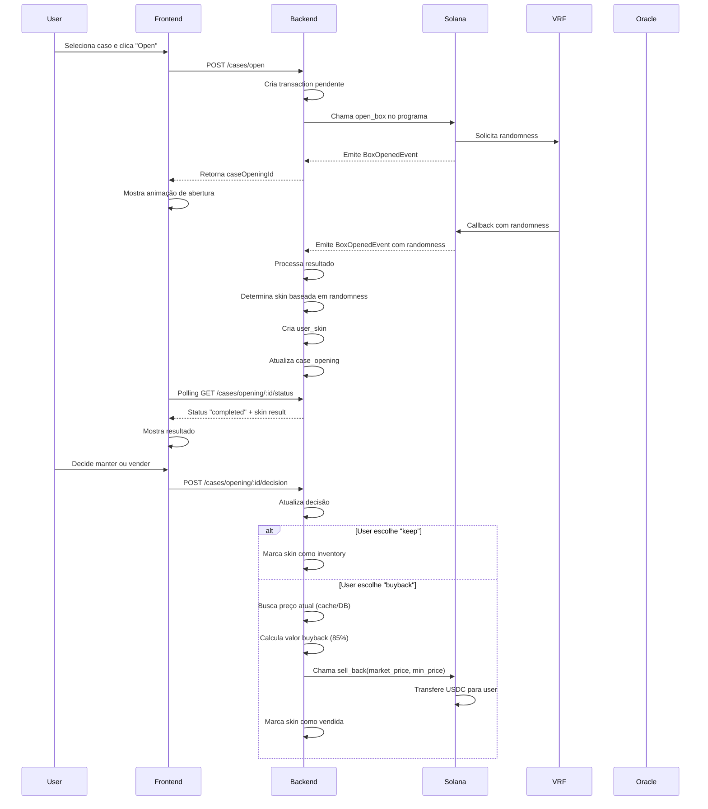
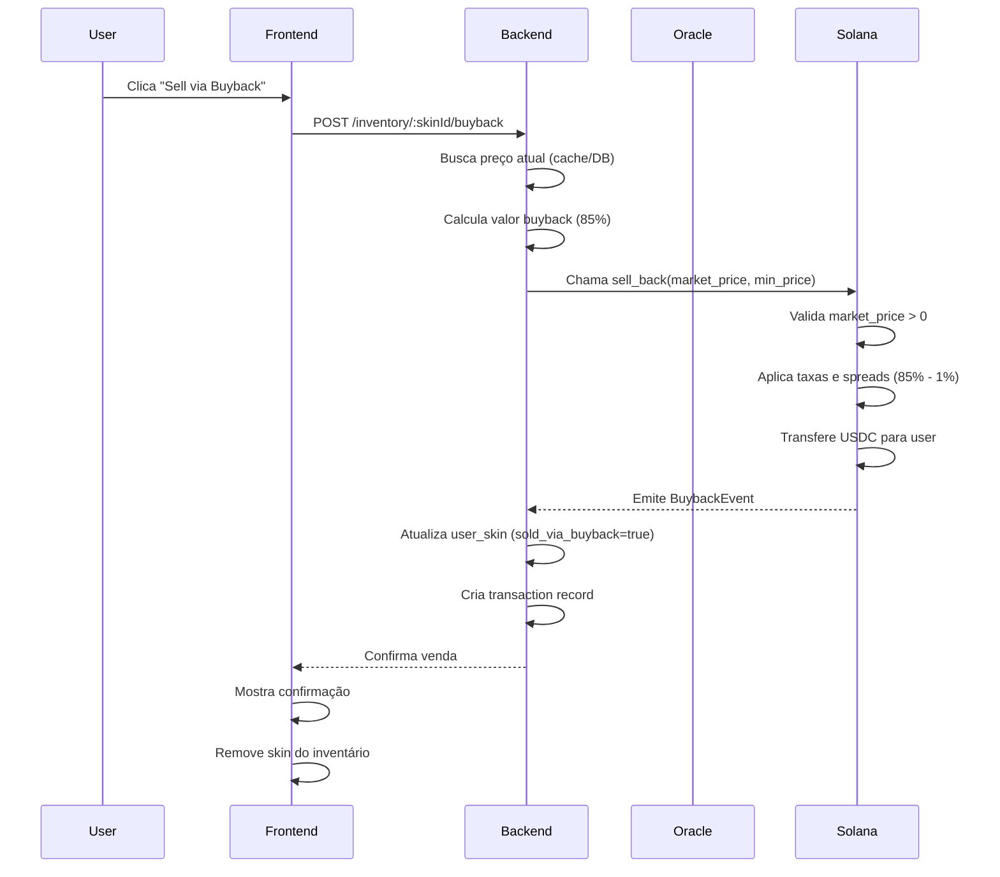
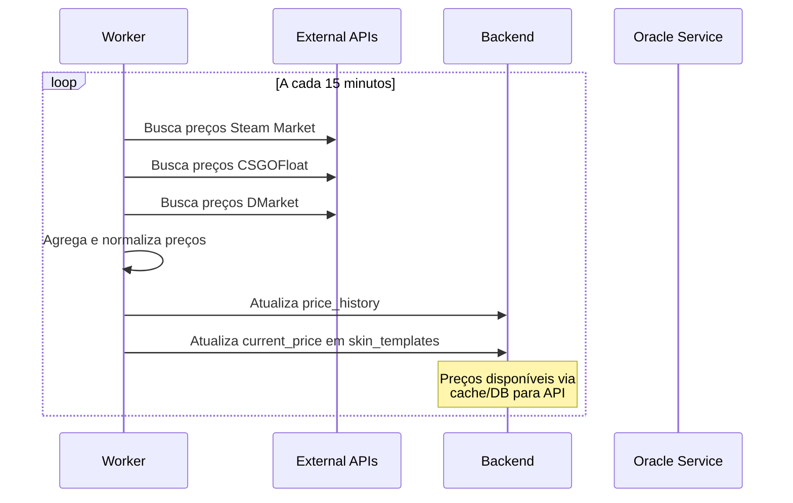
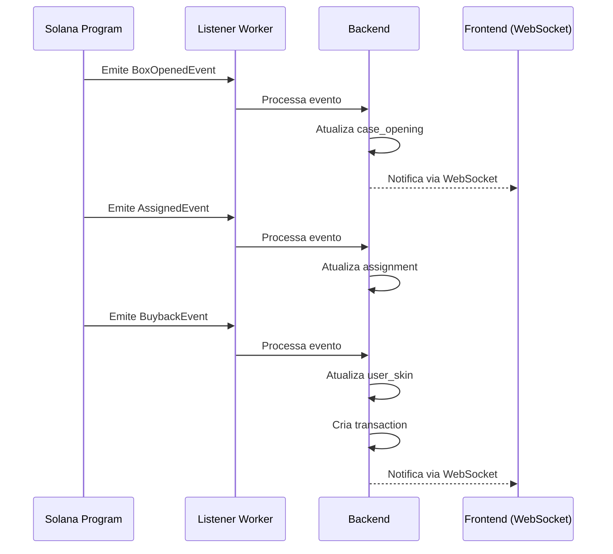

# SolSkins Backend Knowledge Base

## Modelagem do Banco de Dados

### Entidades Principais

#### Users
```sql
CREATE TABLE users (
    id UUID PRIMARY KEY DEFAULT gen_random_uuid(),
    wallet_address VARCHAR(44) UNIQUE NOT NULL,
    username VARCHAR(50),
    email VARCHAR(255),
    created_at TIMESTAMP DEFAULT NOW(),
    updated_at TIMESTAMP DEFAULT NOW(),
    last_login TIMESTAMP,
    is_active BOOLEAN DEFAULT TRUE,
    total_spent DECIMAL(10,2) DEFAULT 0,
    total_earned DECIMAL(10,2) DEFAULT 0,
    cases_opened INTEGER DEFAULT 0
);
```

#### LootBoxTypes
```sql
CREATE TABLE loot_box_types (
    id UUID PRIMARY KEY DEFAULT gen_random_uuid(),
    name VARCHAR(100) NOT NULL,
    description TEXT,
    price_sol DECIMAL(10,4) NOT NULL,
    price_usdc DECIMAL(10,2),
    image_url VARCHAR(500),
    is_active BOOLEAN DEFAULT TRUE,
    is_featured BOOLEAN DEFAULT FALSE,
    rarity VARCHAR(20) NOT NULL, -- Standard, Premium, Special, Limited, Legendary
    created_at TIMESTAMP DEFAULT NOW(),
    updated_at TIMESTAMP DEFAULT NOW(),
    
    -- Probabilidades de drop
    chance_common DECIMAL(5,2) DEFAULT 0,
    chance_uncommon DECIMAL(5,2) DEFAULT 0,
    chance_rare DECIMAL(5,2) DEFAULT 0,
    chance_epic DECIMAL(5,2) DEFAULT 0,
    chance_legendary DECIMAL(5,2) DEFAULT 0
);
```

#### SkinTemplates
```sql
CREATE TABLE skin_templates (
    id UUID PRIMARY KEY DEFAULT gen_random_uuid(),
    weapon VARCHAR(50) NOT NULL,
    skin_name VARCHAR(100) NOT NULL,
    rarity VARCHAR(20) NOT NULL, -- Common, Uncommon, Rare, Epic, Legendary
    condition VARCHAR(30) NOT NULL, -- Factory New, Minimal Wear, Field-Tested, Well-Worn, Battle-Scarred
    base_price_usd DECIMAL(10,2) NOT NULL,
    image_url VARCHAR(500),
    exterior_image_url VARCHAR(500),
    description TEXT,
    collection VARCHAR(100),
    is_active BOOLEAN DEFAULT TRUE,
    created_at TIMESTAMP DEFAULT NOW(),
    updated_at TIMESTAMP DEFAULT NOW(),
    
    UNIQUE(weapon, skin_name, condition)
);
```

#### LootBoxSkinPools
```sql
CREATE TABLE loot_box_skin_pools (
    id UUID PRIMARY KEY DEFAULT gen_random_uuid(),
    loot_box_type_id UUID REFERENCES loot_box_types(id) ON DELETE CASCADE,
    skin_template_id UUID REFERENCES skin_templates(id) ON DELETE CASCADE,
    weight INTEGER NOT NULL DEFAULT 1, -- Peso para sorteio
    created_at TIMESTAMP DEFAULT NOW(),
    
    UNIQUE(loot_box_type_id, skin_template_id)
);
```

#### UserSkins (NFTs)
```sql
CREATE TABLE user_skins (
    id UUID PRIMARY KEY DEFAULT gen_random_uuid(),
    user_id UUID REFERENCES users(id) ON DELETE CASCADE,
    skin_template_id UUID REFERENCES skin_templates(id),
    nft_mint_address VARCHAR(44) UNIQUE NOT NULL,
    
    -- Dados da abertura
    loot_box_type_id UUID REFERENCES loot_box_types(id),
    opened_at TIMESTAMP NOT NULL,
    
    -- Status
    is_in_inventory BOOLEAN DEFAULT TRUE,
    sold_via_buyback BOOLEAN DEFAULT FALSE,
    buyback_amount DECIMAL(10,2),
    buyback_at TIMESTAMP,
    
    -- Dados do NFT
    metadata_uri VARCHAR(500),
    name VARCHAR(200),
    symbol VARCHAR(10),
    
    -- Tracking
    current_price_usd DECIMAL(10,2),
    last_price_update TIMESTAMP,
    
    created_at TIMESTAMP DEFAULT NOW(),
    updated_at TIMESTAMP DEFAULT NOW()
);
```

#### Transactions
```sql
CREATE TABLE transactions (
    id UUID PRIMARY KEY DEFAULT gen_random_uuid(),
    user_id UUID REFERENCES users(id) ON DELETE CASCADE,
    transaction_type VARCHAR(20) NOT NULL, -- open_case, buyback, payout
    
    -- Valores
    amount_sol DECIMAL(10,4),
    amount_usdc DECIMAL(10,2),
    amount_usd DECIMAL(10,2) NOT NULL,
    
    -- Referências
    loot_box_type_id UUID REFERENCES loot_box_types(id),
    user_skin_id UUID REFERENCES user_skins(id),
    
    -- Blockchain
    tx_hash VARCHAR(88) UNIQUE,
    block_slot BIGINT,
    confirmed_at TIMESTAMP,
    
    -- Status
    status VARCHAR(20) DEFAULT 'pending', -- pending, confirmed, failed
    
    created_at TIMESTAMP DEFAULT NOW(),
    updated_at TIMESTAMP DEFAULT NOW()
);
```

#### CaseOpenings
```sql
CREATE TABLE case_openings (
    id UUID PRIMARY KEY DEFAULT gen_random_uuid(),
    user_id UUID REFERENCES users(id) ON DELETE CASCADE,
    loot_box_type_id UUID REFERENCES loot_box_types(id),
    
    -- Processo de abertura
    vrf_request_id VARCHAR(100),
    randomness_seed VARCHAR(66), -- Resultado do VRF
    
    -- Resultado
    skin_template_id UUID REFERENCES skin_templates(id),
    user_skin_id UUID REFERENCES user_skins(id),
    
    -- Decisão do usuário
    user_decision VARCHAR(20), -- keep, buyback
    decision_at TIMESTAMP,
    
    -- Tracking
    opened_at TIMESTAMP DEFAULT NOW(),
    completed_at TIMESTAMP,
    
    created_at TIMESTAMP DEFAULT NOW(),
    updated_at TIMESTAMP DEFAULT NOW()
);
```

#### PriceHistory
```sql
CREATE TABLE price_history (
    id UUID PRIMARY KEY DEFAULT gen_random_uuid(),
    skin_template_id UUID REFERENCES skin_templates(id) ON DELETE CASCADE,
    price_usd DECIMAL(10,2) NOT NULL,
    source VARCHAR(50) NOT NULL, -- steam_market, csgofloat, dmarket
    recorded_at TIMESTAMP DEFAULT NOW(),
    
    INDEX(skin_template_id, recorded_at)
);
```

#### UserSessions
```sql
CREATE TABLE user_sessions (
    id UUID PRIMARY KEY DEFAULT gen_random_uuid(),
    user_id UUID REFERENCES users(id) ON DELETE CASCADE,
    wallet_address VARCHAR(44) NOT NULL,
    session_token VARCHAR(255) UNIQUE NOT NULL,
    expires_at TIMESTAMP NOT NULL,
    created_at TIMESTAMP DEFAULT NOW(),
    last_used_at TIMESTAMP DEFAULT NOW(),
    is_active BOOLEAN DEFAULT TRUE
);
```

### Índices e Performance

```sql
-- Índices para consultas frequentes
CREATE INDEX idx_users_wallet ON users(wallet_address);
CREATE INDEX idx_user_skins_user_inventory ON user_skins(user_id, is_in_inventory);
CREATE INDEX idx_transactions_user_type ON transactions(user_id, transaction_type);
CREATE INDEX idx_transactions_status ON transactions(status);
CREATE INDEX idx_case_openings_user ON case_openings(user_id);
CREATE INDEX idx_loot_box_types_active ON loot_box_types(is_active, is_featured);
```

## API Endpoints

### Autenticação

#### POST `/auth/connect`
Conectar wallet e obter token de sessão.

**Request Body:**
```json
{
  "walletAddress": "7xKXtg2CW87d97TXJSDpbD5jBkheTqA83TZRuJosgAsU",
  "signature": "signature_from_wallet",
  "message": "Login to SolSkins"
}
```

**Response:**
```json
{
  "success": true,
  "user": {
    "id": "uuid",
    "walletAddress": "7xKXtg2CW87d97TXJSDpbD5jBkheTqA83TZRuJosgAsU",
    "username": null,
    "totalSpent": 0,
    "totalEarned": 0,
    "casesOpened": 0
  },
  "sessionToken": "jwt_token",
  "expiresAt": "2024-01-20T10:30:00Z"
}
```

#### POST `/auth/disconnect`
Invalidar sessão atual.

### Marketplace

#### GET `/marketplace/loot-boxes`
Listar todos os tipos de loot boxes disponíveis.

**Query Parameters:**
- `search` (string): Busca por nome
- `sortBy` (string): featured, price-low, price-high, name
- `filterBy` (string): all, standard, premium, special, limited, legendary
- `page` (number): Página (default: 1)
- `limit` (number): Itens por página (default: 20)

**Response:**
```json
{
  "success": true,
  "data": [
    {
      "id": "uuid",
      "name": "Weapon Case",
      "description": "Contains various weapon skins",
      "priceSol": 2.5,
      "priceUsdc": 25.00,
      "imageUrl": "https://...",
      "rarity": "Standard",
      "isActive": true,
      "isFeatured": true,
      "chances": {
        "common": 79.92,
        "uncommon": 15.98,
        "rare": 3.2,
        "epic": 0.64,
        "legendary": 0.26
      }
    }
  ],
  "pagination": {
    "page": 1,
    "limit": 20,
    "total": 6,
    "totalPages": 1
  }
}
```

#### GET `/marketplace/loot-boxes/:id`
Detalhes de um tipo específico de loot box.

**Response:**
```json
{
  "success": true,
  "data": {
    "id": "uuid",
    "name": "Weapon Case",
    "description": "Contains various weapon skins",
    "priceSol": 2.5,
    "priceUsdc": 25.00,
    "imageUrl": "https://...",
    "rarity": "Standard",
    "chances": {
      "common": 79.92,
      "uncommon": 15.98,
      "rare": 3.2,
      "epic": 0.64,
      "legendary": 0.26
    },
    "possibleSkins": [
      {
        "id": "uuid",
        "weapon": "AK-47",
        "skinName": "Redline",
        "rarity": "Rare",
        "condition": "Field-Tested",
        "basePriceUsd": 45.20,
        "imageUrl": "https://...",
        "weight": 100
      }
    ]
  }
}
```

### Case Opening

#### POST `/cases/open`
Iniciar abertura de caso (criar NFT e solicitar VRF).

**Request Body:**
```json
{
  "lootBoxTypeId": "uuid",
  "paymentMethod": "SOL" // SOL ou USDC
}
```

**Response:**
```json
{
  "success": true,
  "data": {
    "caseOpeningId": "uuid",
    "nftMintAddress": "new_nft_mint_address",
    "vrfRequestId": "vrf_request_123",
    "transactionId": "uuid",
    "estimatedCompletionTime": "2024-01-15T14:35:00Z"
  }
}
```

#### GET `/cases/opening/:id/status`
Verificar status da abertura de caso.

**Response:**
```json
{
  "success": true,
  "data": {
    "id": "uuid",
    "status": "completed", // pending, processing, completed, failed
    "vrfRequestId": "vrf_request_123",
    "randomnessSeed": "0x...",
    "skinResult": {
      "id": "uuid",
      "weapon": "AK-47",
      "skinName": "Redline",
      "rarity": "Rare",
      "condition": "Field-Tested",
      "currentPriceUsd": 45.20,
      "imageUrl": "https://...",
      "nftMintAddress": "nft_mint_address"
    },
    "openedAt": "2024-01-15T14:30:00Z",
    "completedAt": "2024-01-15T14:32:00Z"
  }
}
```

#### POST `/cases/opening/:id/decision`
Decisão do usuário após abertura (manter ou vender).

**Request Body:**
```json
{
  "decision": "keep" // keep ou buyback
}
```

**Response:**
```json
{
  "success": true,
  "data": {
    "decision": "keep",
    "nftMintAddress": "nft_mint_address",
    "addedToInventory": true
  }
}
```

### Inventory

#### GET `/inventory`
Listar skins do usuário.

**Query Parameters:**
- `search` (string): Busca por nome da skin ou arma
- `sortBy` (string): date, price-high, price-low, name, rarity
- `filterBy` (string): all, common, uncommon, rare, epic, legendary
- `page` (number): Página
- `limit` (number): Itens por página

**Response:**
```json
{
  "success": true,
  "data": {
    "skins": [
      {
        "id": "uuid",
        "weapon": "AK-47",
        "skinName": "Redline",
        "rarity": "Rare",
        "condition": "Field-Tested",
        "currentPriceUsd": 45.20,
        "imageUrl": "https://...",
        "nftMintAddress": "nft_mint_address",
        "openedAt": "2024-01-15T14:30:00Z",
        "canSell": true
      }
    ],
    "summary": {
      "totalValue": 2893.70,
      "totalItems": 5,
      "rarityBreakdown": {
        "common": 1,
        "uncommon": 0,
        "rare": 2,
        "epic": 1,
        "legendary": 1
      }
    }
  },
  "pagination": {
    "page": 1,
    "limit": 20,
    "total": 5,
    "totalPages": 1
  }
}
```

#### POST `/inventory/:skinId/buyback`
Vender skin via buyback instantâneo.

**Request Body:**
```json
{
  "minAcceptablePrice": 38.42 // 85% do valor atual
}
```

**Response:**
```json
{
  "success": true,
  "data": {
    "soldSkin": {
      "id": "uuid",
      "weapon": "AK-47",
      "skinName": "Redline",
      "originalPrice": 45.20,
      "buybackPrice": 38.42,
      "buybackPercentage": 85
    },
    "transaction": {
      "id": "uuid",
      "amountUsdc": 38.42,
      "txHash": "transaction_hash",
      "status": "pending"
    }
  }
}
```

### Transaction History

#### GET `/history/transactions`
Histórico de transações do usuário.

**Query Parameters:**
- `search` (string): Busca por skin ou caso
- `type` (string): all, open_case, buyback, payout
- `sortBy` (string): date, amount-high, amount-low
- `page` (number): Página
- `limit` (number): Itens por página

**Response:**
```json
{
  "success": true,
  "data": {
    "transactions": [
      {
        "id": "uuid",
        "type": "open_case",
        "amountSol": -2.5,
        "amountUsd": -25.00,
        "lootBoxType": {
          "name": "Weapon Case"
        },
        "resultSkin": {
          "weapon": "AK-47",
          "skinName": "Redline",
          "rarity": "Rare",
          "imageUrl": "https://..."
        },
        "txHash": "tx_hash",
        "status": "confirmed",
        "createdAt": "2024-01-15T14:30:00Z",
        "confirmedAt": "2024-01-15T14:32:00Z"
      }
    ],
    "summary": {
      "totalSpent": 47.50,
      "totalEarned": 2189.37,
      "netProfit": 2141.87,
      "casesOpened": 15,
      "skinsOwned": 5,
      "skinsSold": 10
    }
  },
  "pagination": {
    "page": 1,
    "limit": 20,
    "total": 25,
    "totalPages": 2
  }
}
```

### Leaderboard & Social

#### GET `/leaderboard`
Ranking de usuários por valor de inventário.

**Query Parameters:**
- `period` (string): all-time, monthly, weekly
- `metric` (string): inventory-value, cases-opened, profit
- `limit` (number): Número de usuários (default: 100)

**Response:**
```json
{
  "success": true,
  "data": [
    {
      "rank": 1,
      "user": {
        "id": "uuid",
        "username": "CryptoGamer",
        "walletAddress": "7xKXtg2CW87d97TXJSDpbD5jBkheTqA83TZRuJosgAsU"
      },
      "inventoryValue": 12450.00,
      "casesOpened": 234,
      "totalSpent": 2890.50,
      "totalEarned": 15340.50,
      "netProfit": 12450.00
    }
  ]
}
```

#### GET `/activity/recent`
Atividade recente da plataforma.

**Query Parameters:**
- `limit` (number): Número de atividades (default: 50)

**Response:**
```json
{
  "success": true,
  "data": [
    {
      "id": "uuid",
      "type": "case_opened",
      "user": {
        "username": "CryptoGamer",
        "walletAddress": "7xKXtg..."
      },
      "skin": {
        "weapon": "AK-47",
        "skinName": "Redline",
        "rarity": "Rare",
        "imageUrl": "https://...",
        "valueUsd": 45.20
      },
      "timestamp": "2024-01-15T14:30:00Z"
    }
  ]
}
```

### Admin Endpoints

#### GET `/admin/stats/overview`
Estatísticas gerais da plataforma.

**Response:**
```json
{
  "success": true,
  "data": {
    "users": {
      "total": 1250,
      "active30d": 342,
      "active7d": 89
    },
    "revenue": {
      "totalSol": 2850.75,
      "totalUsd": 285075.50,
      "last30dSol": 450.25,
      "last30dUsd": 45025.00
    },
    "cases": {
      "totalOpened": 5420,
      "last30d": 850,
      "last7d": 125
    },
    "inventory": {
      "totalNfts": 3200,
      "totalValueUsd": 450000.00,
      "buybacksSold": 2220
    }
  }
}
```

## Fluxos de Negócio

### Fluxo de Abertura de Caso



### Fluxo de Buyback



### Fluxo de Sincronização de Preços



### Fluxo de Eventos Blockchain



## Integração com Solana

### Configuração do Programa Anchor

O programa já está estruturado em `src/packages/anchor/programs/phygibox/src/lib.rs` com as seguintes funcionalidades:

- **initialize**: Configuração inicial do programa
- **mint_box**: Criação de NFTs para casos
- **open_box**: Abertura de caso com VRF
- **assign**: Atribuição de skin ao NFT
- **sell_back**: Buyback instantâneo
- **vrf_callback**: Callback do Switchboard VRF

### Worker de Eventos

Implementar listener em `src/worker/src/listeners/onchain-listener.ts` para processar eventos:

```typescript
import { Connection, PublicKey } from '@solana/web3.js';
import { Program, AnchorProvider } from '@coral-xyz/anchor';

export class OnchainListener {
  async listenToEvents() {
    // Escutar BoxOpenedEvent
    this.program.addEventListener('BoxOpenedEvent', (event) => {
      this.handleBoxOpened(event);
    });
    
    // Escutar BuybackEvent
    this.program.addEventListener('BuybackEvent', (event) => {
      this.handleBuyback(event);
    });
  }
  
  private async handleBoxOpened(event: any) {
    // Atualizar database com resultado VRF
    // Determinar skin baseada no randomness
    // Criar user_skin record
  }
  
  private async handleBuyback(event: any) {
    // Confirmar transação de buyback
    // Atualizar user_skin como vendida
    // Criar transaction record
  }
}
```

### Sistema de Preços Off-Chain

Implementado em `src/worker/src/jobs/price-oracle.ts`:

```typescript
export class PriceOracle {
  async updatePrices(): Promise<void> {
    // 1. Buscar preços de APIs externas (Steam, CSGOFloat, DMarket)
    // 2. Normalizar e validar dados
    // 3. Calcular VWAP/median para preço de mercado
    // 4. Armazenar em cache (Redis) com TTL de 15 minutos
    // 5. Atualizar price_history no banco de dados
  }

  async getPriceForSkin(skinId: string): Promise<OraclePrice | null> {
    // Retornar preço atual do cache ou banco
    // Backend usa este preço como parâmetro para sell_back
    return { inventoryId, price, timestamp };
  }
}
```

**Nova Arquitetura (Sem Oracle On-Chain)**:
- ✅ Preços mantidos off-chain em cache/banco de dados
- ✅ Backend lê preços do cache ao processar buyback
- ✅ Backend passa `market_price` diretamente como parâmetro para `sell_back(market_price, min_price)`
- ✅ Programa Solana valida apenas que `market_price > 0`
- ✅ Sem verificação de assinatura on-chain - confiança no backend
- ✅ Mais simples, mais rápido, menor custo de transação 